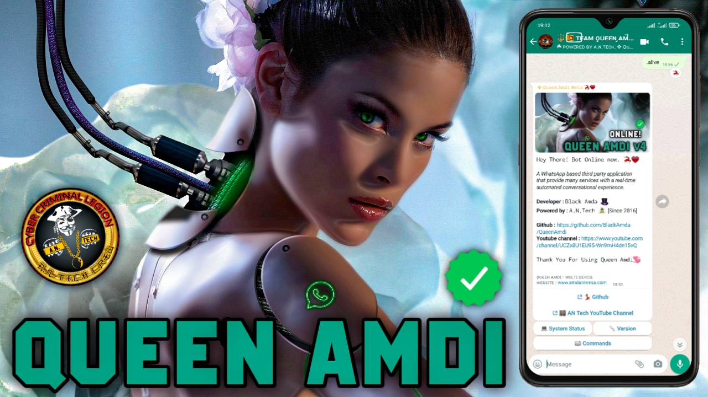

# **QUEEN AMDI💃🏻❤️** - _A Javascript WhatsApp User Bot_
*A WhatsApp based third party application that provide many services with a real-time automated conversational experience.*

**Queen Amdi** is an user bot for WhatsApp that allowing you to get done so many tasks. This project mainly focusing on make user's work easy. This project coded with Javascript and Docker. And using **[Baileys](https://github.com/adiwajshing/Baileys)** as the WA Web API. Developer or Team members are not responsible for your usage mistakes and not using wisely. Also, you have no authorities do any modifications to this project. Enjoy!🎈

### Visit our official Queen Amdi 4.0v [Multi-Device] website for deploy instructions

**[» Official Website](https://amdaniwasa.com)**

### You can join our Beta Testing WhatsApp Group by this invite link

**[» Join beta test group](https://chat.whatsapp.com/LhWHB9gftfwIv29C4etUHH)**

## 🐝 Queen Amdi Team - A.N.Tech *[ Since 2016 ]*

|  |  |  |
|---|---|---|
| **[Achintha Bandara](https://github.com/BlackAmda)** Founder & Developer *[Black Amda]* | **[Sasmitha Ashinsana](https://github.com/SinhalayaCreator)** Co-Admin/Developer | **[Lil Luzi](https://github.com/Sajiya2002)** User Supporter |
|  |  |  **Kapaya** Group Management | |
| **[Mr.Dina](https://github.com/Dinaaofficial)** Graphic Designer | **[JokaTamah](https://github.com/JokaTamah)** Bug Tester | **Zeus** Group Management |

## License
This project is protected by the `GNU General Public License v3.0.`
Do not edit copyright messages!

## Disclaimer
`WhatsApp` name, its variations and logo are registered trademarks on Facebook. We have nothing to do with the registered trademark.